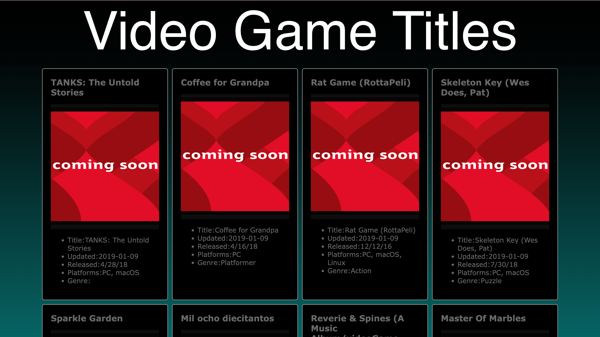

<a href="#currentProgress">---------------- Jump To Current Progress Section ----------------</a>

# SEA Stage 2 - Data Catalog Project

This is the instructions, requirements, and starter for stage two of the Snap Engineering Academy application process.

## Your Task:

<h3 align="center">Create a "catalog" website for something you're passionate about.</h1>

> [!NOTE]
> If you have not used Github or programmed a website with JavaScript before, that's OK! Part of the challenge is figuring out things you're not familiar with.  

## Requirements - Your Catalog Website Should...

 - Show off your understanding of basic data structures: arrays and objects.  
 - Display a substantial amount of interesting data in a "Catalog"! You can look online for datasets or make your own. Your data should be easy to find in your source code, held either in variables defined at the top of scripts.js or imported from a file you added.  
 - Have two or more features that “operate” on your data, modifying the data and how you display it. Data “operations” are things like filtering, searching, sorting, updating, adding, removing and so on. *Imagine what users would want to do while using your catalog website, and make it a feature!*  
 - Look polished. Use HTML and CSS to customize how you display your data. Display your data thoughtfully, as it’s much more useful that way!  
 - Be built from this starter code, though you can change anything you like. *The starter code shows a simple example of a data catalog website and introduces you to JS/html/css, but you should be making significant changes and improvements.*  
 - Be an original website. Please do not submit something you’ve already done for a school project, internship, or client. *Using online resources for reference and guidance is encouraged, but be a responsible developer and make sure you understand every line of code in your project.*

## Getting Started

1. Create a Github account if you haven't already.

2. Click the green "Use as Template" button in the upper right corner, then choose the "create a new repository" option.  
  a. Choose yourself as the owner  
  b. Give your repository a name  
  c. Click "Create Repository"  

3. Copy or Download the repository files to your own computer. There are many ways to do this, it's up to you!

4. Start editing the website by using a text editor for the `index.html`, `style.css`, and `scripts.js` files. As you edit, preview your website by opening `index.html` with your web browser (double clicking `index.html` should open it in a web browser). When you're done, you should see something like this:

## Submitting

1. Publish your website to the internet! You can use any method you like, but we recommend [Github Pages.](https://docs.github.com/en/pages/getting-started-with-github-pages/creating-a-github-pages-site#creating-your-site)

2. Update your Github repository so it has the most recent version of your website's source code.

3. Submit the URL to your published website and the link to your Github repository to the google form in your email.

# Current Progress
<section id="currentProgress">
<ul>
    <li>Project is being edited in VIM.</li>
    <li>Used <strong>python</strong> command "python3 -m http.server" in
    <strong>terminal</strong> to <strong>locally host</strong> the website in order to bypass <strong>cors runtime errors</strong> where the
    browser is <strong>unable to access local files</strong> due to <strong>security restrictions</strong>.
    </li>
    <li>Started off attempting to use <strong>csv file</strong> data acquired from <a target="_blank" href="https://www.kaggle.com/datasets/jummyegg/rawg-game-dataset?resource=download">Here</a> by parsing into a bunch of arrays
    with strings. Ended up using an online converter to convert <strong>csv file to json</strong>
    in preparation of possible future api integration. Used fetch in js to process this data.</li>
    <li>Used array of objects for data read from json file. And it
    all loads on the initial loading of the page as well.</li>
    <li>Added fieldset for user to input data for a new game to add</li>
    <li>Webpage now has the 2 required feature to either add or remove data</li>
    <li>Was not able to work on the CSS or JS too much but still added some of
    my own changes</li>
    <li>Publishing onto GitHub Pages for submission</li>
    <li>to be continued...</li>
</ul>
</section>

<h3>Screenshots</h3>

